### Hi there 👋

 
 

<!-- [Pinned](./profile/pin-readme-tools-github-readme-stats.svg)-->

- 🔭 I’m currently focus on Infra System.
- 10+ Years of Programming Experience
- Expert At Java And Backend Engineering
- Expert At microservice architecture framework domain, like RPC, Servce Discovery, Load Balance, Telemetry(Tracing, Metric, Log)
- Recently, Intereted on AI and Rust

Member:
- CNCF Opentelemetry
  
Commiter:
- Alibaba Nacos
  
Contributor:
- Apache Hive / Apache Commons

  
### How to reach me 📫 
- **Email：xshalk [at] 163.com**

<!--
**shalk/shalk** is a ✨ _special_ ✨ repository because its `README.md` (this file) appears on your GitHub profile.

Here are some ideas to get you started:

- 🔭 I’m currently working on ...
- 🌱 I’m currently learning ...
- 👯 I’m looking to collaborate on ...
- 🤔 I’m looking for help with ...
- 💬 Ask me about ...
- 📫 How to reach me: ...
- 😄 Pronouns: ...
- ⚡ Fun fact: ...
-->
